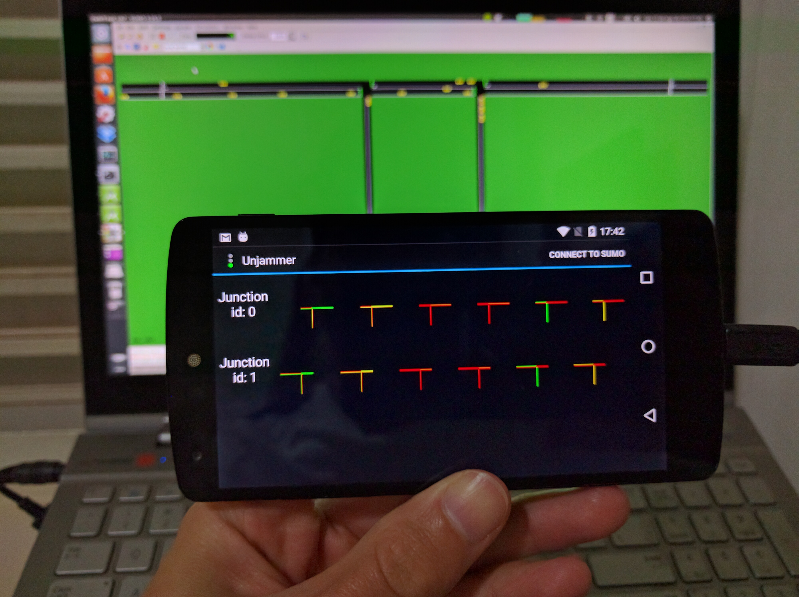

# traffic-signal-control-app-android-remote-controller

A SUMO traffic signal remote controller implemented as an Android App! Uhuu! (TraCI4J adapted, transformed into some sort of TraCI4Android and included and a .jar in libs folder)

## What is the point?

The objective here is to exemplify in a fun way how to interact with the SUMO simulation through TraCI, specifically changing the phase of one junction of traffic lights. By running the app, you will be able to choose the phase of any junction of traffic lights during the SUMO simulation, just like a TV remote controller. Then you can just check in the open source code how it is done! :) 

## How does it works?

First, you have to open a SUMO simulation that listens for a TraCI connection in a remote port. This is where our remote control is going to connect. 

Guess what? I have made this step simple for you by having some shell scripts in sumoExamples/ folder ready to connect and listen to a remote port for a TraCI connection. 

You will find four different directories, each one for a network model:

 - simpleT: composed by a single junction linking three main roads.
 - twinT: two junctions linking four main roads.
 - corridor: four junctions connecting many roads.
 - manhattan: grid composed by 9 junctions.

In each directory, you will find four files:

 - 'model'.net.xml: the network model definition, to be used in the sumo simulation. This network definition includes the default traffic lights plan, which was not optimized for any specific traffic demand, but generated just as one random feasible plan.
 - 'model'.rou.xml: the vehicles routes definition, to be used in the sumo simulation. This routes were randomly generated using the SUMO duarouter tool.
 - 'model'.pdf: an image of the network model.
 - 'model'.sh: the bash shell script to be run in order to start the simulation.

Pre-requisites:
- have a SUMO version greater than 0.18 installed and running.

Steps:

 1 - After running the 'model'.sh, you will notice that SUMO GUI program will run and keep waiting for our remote control to connect.
 
 2 - Run the Unjammer app and click on the top right corner "Connect to SUMO". Type the IP address of the machine where you run the SUMO instance via 'model'.sh, and type 8000 for the remote port (this is the default value in the shell script, if you change it type accordingly).
 
 3 - You will notice that SUMO GUI will start and will need some seconds to load the network model, depending on the size of the network. After the loading, the interface will be ready to run the simulation. All you will have to do is choose the delay in milliseconds (try to start with 1000 ms) and then hit the play button, both actions can be done in the top menu of the SUMO GUI. The commands of the remote controller, however, will not appear to you in the Unjammer app until you hit the 'start' button. After that, you will see the simulation starting and will be able to interact pausing, fast-forwarding, changing the delay, etc.
 
 4 - Once the simulation starts, you will see that your Unjammer app has all the possible phases of each junction for you to choose. Just click any phase and you will see it instantly change in the simulation! Magic!
 
 
 
 Obs: depending on the size of the network, and consequent number of junctions, it may not be easy to recognize which junctions is controlled in each line of the Unjammer app gridview. We tried to make it easier by writing the id of the junction in the left side of the grid row, so you can check in SUMO GUI where each of these junction is located by using the '?' tool.

In the end of the simulation, an output file, containing the summary of the main measurements taken in the simulation, such as cars mean waiting time, will be written to a file called output_sumo.'model'.xml. This way, you can challenge anyone to control the traffic lights and score a better waiting time than you, just like in a game.

Enjoy!

## License

    Copyright 2016 CST-Group

    Licensed under the Apache License, Version 2.0 (the "License");
    you may not use this file except in compliance with the License.
    You may obtain a copy of the License at

       http://www.apache.org/licenses/LICENSE-2.0

    Unless required by applicable law or agreed to in writing, software
    distributed under the License is distributed on an "AS IS" BASIS,
    WITHOUT WARRANTIES OR CONDITIONS OF ANY KIND, either express or implied.
    See the License for the specific language governing permissions and
    limitations under the License.
